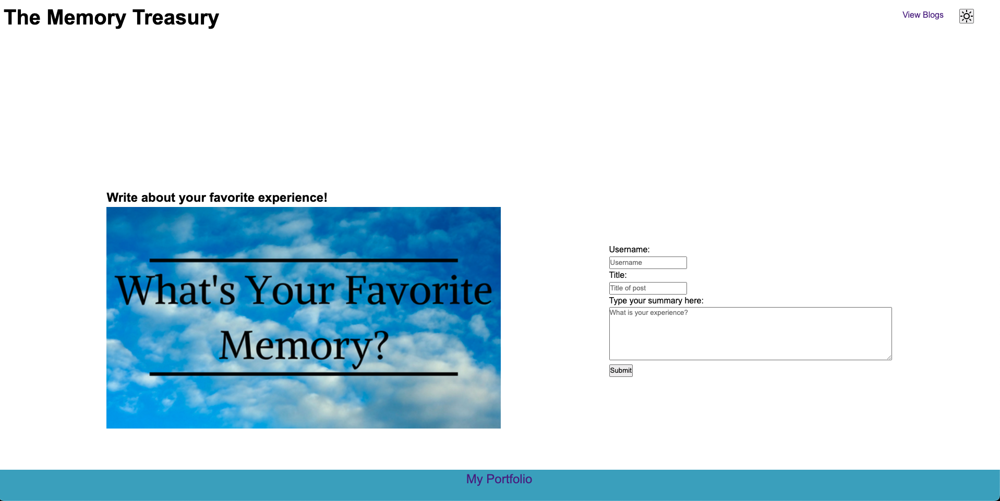
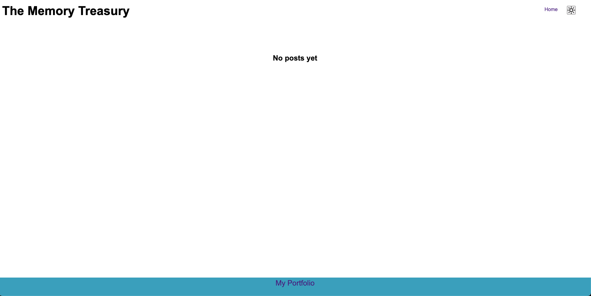
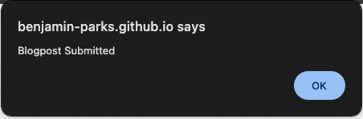
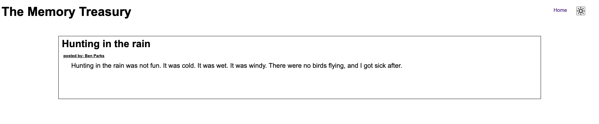

# Ben Parks Blog Posting Site

## Description
This is a website that allows the user to make blog posts in a diary-like fashion where it stores the data locally on the browser but doesn't push anything to the internet. 

## Purpose
This website was built to act as a favorite memory storage device that formats stories in a blogpost format. 

## Installation
No installation needed to view this website. Just to to https://benjamin-parks.github.io/Parks-Blog-Site/ to view it. 

## Using the Website
Fill out the form and upon submitting, you will be brought to the blog page from the home page. It will create your post and it will be viewable there. If you navigate to the blog page by clicking the "View Blogs" link before you make a post, it will say that there are no posts yet. If you try to submit a form with empty inputs, it will prompt you to fix it before submitting.

## Screenshots

